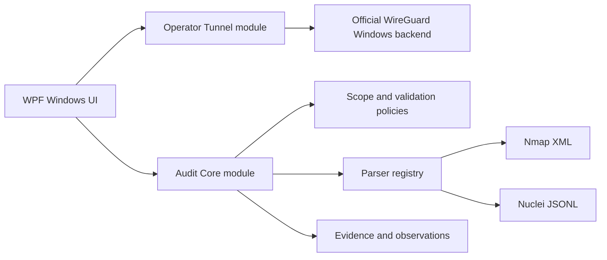

# Operator Security Workbench

> A security-focused Windows desktop workbench combining a WireGuard control plane with a modular, evidence-driven audit framework.

Operator Security Workbench is an open-source C#/.NET project built around one core principle:

**the application owns policy, workflow and visibility; proven security backends own the security primitives.**

The VPN module does not implement a VPN protocol or cryptography. It is designed to work with the official WireGuard Windows tunnel service. The audit module is designed for authorized assessment workflows and normalizes tool output into traceable observations and evidence.

> **Early development / MVP** — not production-ready. Do not use this project to protect sensitive traffic or assess systems without explicit authorization.

## Why this project exists

Operator Security Workbench is intentionally more than a UI demo. It is a portfolio project for secure Windows software engineering, combining:

- desktop application architecture;
- Windows service and privilege-boundary design;
- VPN lifecycle and network-policy management;
- structured security-tool output parsing;
- evidence provenance and audit-session workflows;
- threat modeling, tests and security documentation.

## Modules

The project is modular in code, but delivered as one Windows application.

### Operator Tunnel

The WireGuard control-plane module is responsible for:

- importing and managing WireGuard profiles;
- strict configuration validation;
- connect / disconnect lifecycle control;
- tunnel status, handshake and transfer statistics;
- DNS and kill-switch policy boundaries;
- AllowedIPs visualization;
- connection and error logging without secret leakage;
- system-tray operation and single-instance behavior.

WireGuard remains responsible for tunnel cryptography and packet protection. Operator Tunnel owns the user-facing workflow, policy checks, state presentation and Windows integration.

### Audit Core

The audit module is an evidence-first workspace for authorized assessments:

- audit projects with explicit scope;
- persistent audit sessions;
- scope enforcement for scan targets;
- normalized hosts, ports, services and notes;
- raw evidence storage with provenance metadata;
- parser registry for modular tool integrations;
- secure Nmap XML parsing;
- Nuclei JSONL import;
- observations and findings workflow with verification states;
- inventory summaries and audit history.

The framework is designed to support assessment and verification. It is not an automated exploitation framework.

## Current MVP capabilities

The current build already includes:

- cyberpunk / terminal-inspired WPF interface;
- project creation, editing, deletion and persistence;
- session start and end controls;
- live Nmap terminal integration with structured XML output;
- safe Nmap target validation and project-scope enforcement;
- Nmap XML import from disk;
- Nuclei JSONL import from disk;
- normalized observation browsing;
- evidence browsing and provenance display;
- finding creation and explicit verification workflow;
- automatic workspace restoration on application startup;
- parser and security-boundary unit tests.

## Architecture



The intended privilege model keeps the desktop UI separate from privileged operations. Sensitive actions should cross a narrow, authenticated local service boundary rather than granting broad administrative access to the whole UI process.

## Security principles

- Do not invent cryptography when a reviewed backend already exists.
- Treat imported tool output as untrusted input.
- Fail closed when target scope cannot be validated.
- Disable external XML resolution and reject dangerous XML features.
- Preserve raw evidence separately from normalized observations.
- Keep private keys and secrets out of logs, telemetry, screenshots and crash reports.
- Require explicit human verification before an observation becomes a confirmed finding.
- Make the privilege boundary visible and documented.

Read the project security documentation:

- [Architecture](docs/ARCHITECTURE.md)
- [Threat model](docs/THREAT-MODEL.md)
- [Development roadmap](docs/ROADMAP.md)
- [Project brief](cybersecurity_audit_framework_project_brief.md)

## Try the audit MVP

1. Build and start the application.
2. Open **Audit Projects** and create a project with an authorized scope.
3. Start an audit session.
4. Import one of the included fixtures:
   - [demo-nmap.xml](test-data/demo-nmap.xml)
   - [demo-nuclei.jsonl](test-data/demo-nuclei.jsonl)
5. Open **Observations**, **Evidence** or **Findings** to inspect the result.

The included fixtures are synthetic demo data and are safe to use for local testing.

## Build locally

Requirements:

- Windows 10/11;
- .NET 8 SDK;
- Visual Studio 2022 or another .NET-compatible editor;
- Nmap is optional for the live terminal feature.

From PowerShell:

```powershell
git clone https://github.com/gazsopatrik/operator-tunnel.git
cd operator-tunnel
.\scripts\build.ps1
```

For a clean restore:

```powershell
.\scripts\build.ps1 -Restore
```

The build script compiles the solution, runs the test suite and prints the generated executable path. The current UI is an MVP shell; the real WireGuard service integration and production hardening remain active development work.

## Testing

The solution includes unit tests for:

- WireGuard configuration parsing and validation;
- tunnel lifecycle and service command generation;
- statistics parsing;
- encrypted profile storage and secret protection;
- audit scope policy;
- Nmap command construction and secure XML parsing;
- Nuclei JSONL parsing;
- evidence, observation, finding, project and session stores.

Run the test project directly:

```powershell
dotnet test OperatorTunnel.Core.Tests/OperatorTunnel.Core.Tests.csproj
```

## Roadmap

- official WireGuard Windows tunnel-service control;
- production-grade privileged service boundary;
- DNS leak and kill-switch integration tests;
- richer parser adapters and tool-runner abstraction;
- artifact hashing and stronger evidence integrity controls;
- audit export and reporting;
- polished information architecture and visual design;
- packaging, signing and release automation.

## License

The license will be selected before the first public release. Until then, treat this repository as source-available development code and do not redistribute it as a finished security product.
